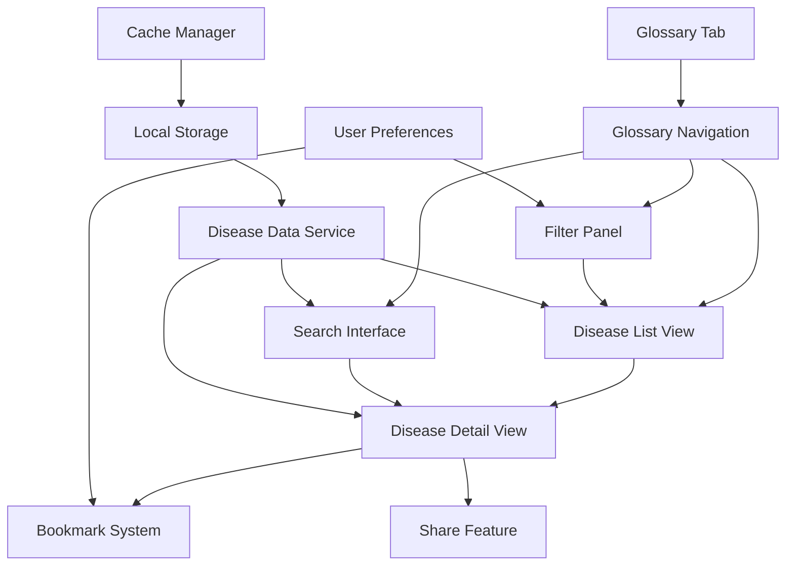
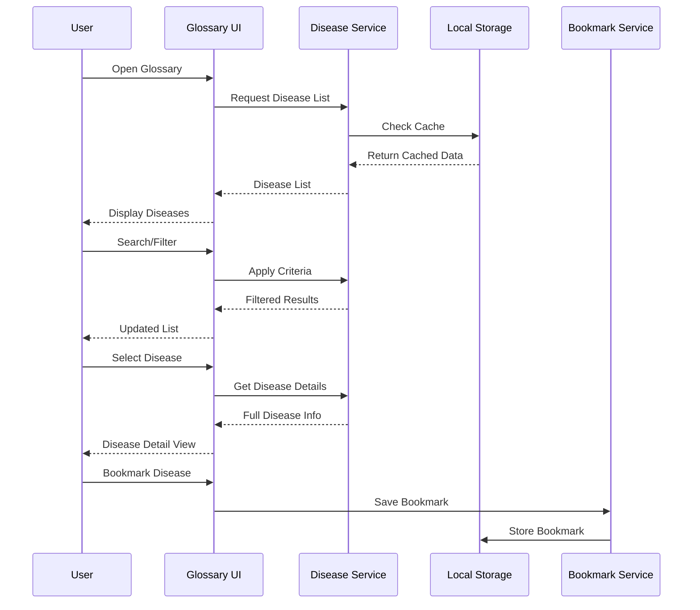

# Disease Glossary Design Document

## Overview

The Disease Glossary is a comprehensive educational feature that provides users with detailed information about poultry diseases. It extends the existing disease data structure and integrates seamlessly with the current PoultryCure app architecture, offering search, filtering, bookmarking, and offline capabilities.

## Architecture

### High-Level Architecture



### Data Flow Architecture



## Components and Interfaces

### Core Components

#### 1. GlossaryNavigator Component
- **Purpose**: Main navigation hub for the glossary feature
- **Location**: `app/(tabs)/glossary.tsx`
- **Props**: None (uses context for user state)
- **Features**:
  - Tab-based navigation (All, Viral, Bacterial, Parasitic, Nutritional)
  - Search bar integration
  - Filter toggle button
  - Disease count display per category

#### 2. DiseaseListView Component
- **Purpose**: Displays paginated list of diseases with search/filter capabilities
- **Location**: `components/glossary/DiseaseListView.tsx`
- **Props**:
  ```typescript
  interface DiseaseListViewProps {
    diseases: ExtendedDiseaseInfo[];
    onDiseaseSelect: (diseaseId: string) => void;
    loading: boolean;
    searchQuery: string;
    activeFilters: FilterCriteria;
  }
  ```
- **Features**:
  - Virtual scrolling for performance
  - Pull-to-refresh functionality
  - Empty state handling
  - Loading states

#### 3. DiseaseCard Component
- **Purpose**: Individual disease item in the list
- **Location**: `components/glossary/DiseaseCard.tsx`
- **Props**:
  ```typescript
  interface DiseaseCardProps {
    disease: ExtendedDiseaseInfo;
    onPress: () => void;
    isBookmarked: boolean;
    onBookmarkToggle: () => void;
  }
  ```
- **Features**:
  - Disease name and category
  - Severity indicator with color coding
  - Affected species icons
  - Quick bookmark toggle
  - Symptom preview (first 3 symptoms)

#### 4. DiseaseDetailView Component
- **Purpose**: Comprehensive disease information display
- **Location**: `app/glossary/[diseaseId].tsx`
- **Features**:
  - Tabbed content (Overview, Symptoms, Treatment, Prevention)
  - Image gallery for visual identification
  - Related diseases section
  - Share functionality
  - Bookmark toggle
  - Print/export options

#### 5. SearchInterface Component
- **Purpose**: Advanced search with autocomplete and suggestions
- **Location**: `components/glossary/SearchInterface.tsx`
- **Features**:
  - Real-time search suggestions
  - Recent searches history
  - Voice search capability (future enhancement)
  - Search result highlighting

#### 6. FilterPanel Component
- **Purpose**: Multi-criteria filtering system
- **Location**: `components/glossary/FilterPanel.tsx`
- **Features**:
  - Severity level filters (Low, Moderate, High)
  - Species filters (Chickens, Turkeys, Ducks, Geese)
  - Category filters (Viral, Bacterial, Parasitic, Nutritional)
  - Clear all filters option
  - Active filter count indicator

### Service Layer

#### 1. DiseaseService
- **Location**: `services/diseaseService.ts`
- **Responsibilities**:
  - Disease data management
  - Search and filtering logic
  - Cache management
  - Data synchronization

```typescript
interface DiseaseService {
  getAllDiseases(): Promise<ExtendedDiseaseInfo[]>;
  getDiseaseById(id: string): Promise<ExtendedDiseaseInfo | null>;
  searchDiseases(query: string, filters?: FilterCriteria): Promise<ExtendedDiseaseInfo[]>;
  getDiseasesbyCategory(category: DiseaseCategory): Promise<ExtendedDiseaseInfo[]>;
  updateDiseaseCache(): Promise<void>;
  getRelatedDiseases(diseaseId: string): Promise<ExtendedDiseaseInfo[]>;
}
```

#### 2. BookmarkService
- **Location**: `services/bookmarkService.ts`
- **Responsibilities**:
  - User bookmark management
  - Bookmark synchronization
  - Bookmark analytics

```typescript
interface BookmarkService {
  getBookmarkedDiseases(userId: string): Promise<string[]>;
  addBookmark(userId: string, diseaseId: string): Promise<void>;
  removeBookmark(userId: string, diseaseId: string): Promise<void>;
  isBookmarked(userId: string, diseaseId: string): Promise<boolean>;
  getUserBookmarkNotes(userId: string, diseaseId: string): Promise<string>;
  updateBookmarkNote(userId: string, diseaseId: string, note: string): Promise<void>;
}
```

#### 3. ShareService
- **Location**: `services/shareService.ts`
- **Responsibilities**:
  - Content sharing functionality
  - Share link generation
  - Share analytics

## Data Models

### Extended Disease Information Model

```typescript
interface ExtendedDiseaseInfo extends DiseaseInfo {
  id: string;
  category: DiseaseCategory;
  causes: string[];
  transmission: TransmissionInfo;
  incubationPeriod: string;
  mortality: MortalityInfo;
  images: DiseaseImage[];
  relatedDiseases: string[];
  lastUpdated: Date;
  sources: string[];
  tags: string[];
}

interface TransmissionInfo {
  method: 'direct' | 'indirect' | 'vector' | 'airborne' | 'waterborne';
  contagiousness: 'low' | 'moderate' | 'high';
  quarantinePeriod: string;
}

interface MortalityInfo {
  rate: string;
  timeframe: string;
  ageGroups: AgeGroupMortality[];
}

interface DiseaseImage {
  id: string;
  url: string;
  caption: string;
  type: 'symptom' | 'lesion' | 'microscopic' | 'treatment';
}

type DiseaseCategory = 'viral' | 'bacterial' | 'parasitic' | 'nutritional' | 'genetic' | 'environmental';

interface FilterCriteria {
  categories: DiseaseCategory[];
  severities: ('low' | 'moderate' | 'high')[];
  species: string[];
  searchQuery?: string;
}
```

### Bookmark Model

```typescript
interface DiseaseBookmark {
  id: string;
  userId: string;
  diseaseId: string;
  note?: string;
  createdAt: Date;
  updatedAt: Date;
}
```

## Error Handling

### Error Types and Responses

1. **Network Errors**
   - Graceful fallback to cached data
   - Clear offline indicators
   - Retry mechanisms with exponential backoff

2. **Data Loading Errors**
   - Skeleton loading states
   - Error boundaries with retry options
   - Partial data display when possible

3. **Search/Filter Errors**
   - Input validation with helpful messages
   - Fallback to showing all results
   - Search suggestion alternatives

4. **Bookmark Errors**
   - Optimistic UI updates with rollback
   - Clear error messages for sync failures
   - Offline bookmark queuing

## Testing Strategy

### Unit Testing
- Disease data parsing and validation
- Search and filter algorithms
- Bookmark service operations
- Share functionality

### Integration Testing
- Disease service with local storage
- Search integration with UI components
- Bookmark synchronization across sessions
- Offline/online state transitions

### UI Testing
- Disease list rendering and performance
- Search interface responsiveness
- Filter panel functionality
- Disease detail view navigation

### Performance Testing
- Large dataset handling (1000+ diseases)
- Search performance with complex queries
- Image loading and caching
- Memory usage optimization

## Performance Considerations

### Optimization Strategies

1. **Data Loading**
   - Implement virtual scrolling for disease lists
   - Lazy load disease details and images
   - Progressive image loading with placeholders
   - Implement efficient caching strategies

2. **Search Performance**
   - Use debounced search input (300ms delay)
   - Implement search result caching
   - Use indexed search for large datasets
   - Optimize filter combinations

3. **Memory Management**
   - Implement image caching with size limits
   - Use React.memo for expensive components
   - Implement proper cleanup in useEffect hooks
   - Monitor and optimize bundle size

4. **Offline Performance**
   - Prioritize critical disease data for caching
   - Implement smart cache eviction policies
   - Use compression for stored data
   - Background sync when connectivity returns

## Security Considerations

1. **Data Integrity**
   - Validate all disease data before storage
   - Implement checksum verification for cached data
   - Sanitize user input in search and notes

2. **User Privacy**
   - Encrypt bookmark data and user notes
   - Implement secure sharing mechanisms
   - Respect user privacy in analytics

3. **Content Security**
   - Validate image sources and content
   - Implement content filtering for user-generated notes
   - Secure API endpoints for data updates

## Accessibility Features

1. **Screen Reader Support**
   - Proper ARIA labels for all interactive elements
   - Semantic HTML structure
   - Alternative text for disease images

2. **Navigation**
   - Keyboard navigation support
   - Focus management in modal dialogs
   - Clear visual focus indicators

3. **Visual Accessibility**
   - High contrast mode support
   - Scalable text and UI elements
   - Color-blind friendly severity indicators

4. **Motor Accessibility**
   - Large touch targets (minimum 44px)
   - Gesture alternatives for complex interactions
   - Voice control compatibility

## Future Enhancements

1. **Advanced Features**
   - AI-powered disease recommendations
   - Symptom-to-disease matching integration
   - Veterinarian-contributed content
   - Community disease reports and updates

2. **Content Expansion**
   - Video content for disease identification
   - Interactive disease progression timelines
   - Regional disease prevalence data
   - Seasonal disease risk indicators

3. **Integration Features**
   - Integration with diagnosis history
   - Treatment tracking from glossary
   - Veterinarian consultation booking
   - Farm management system integration