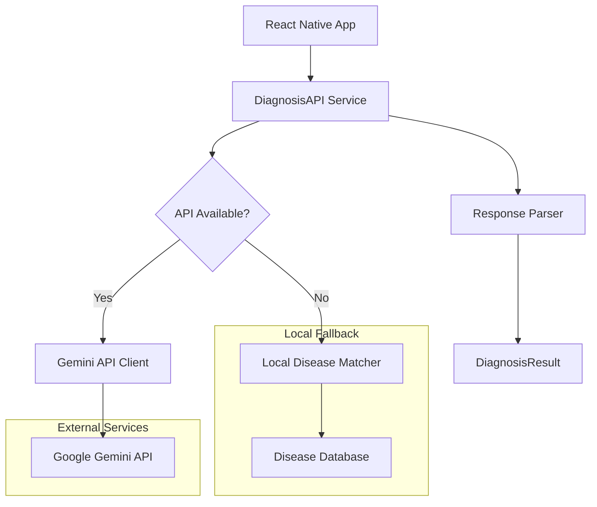

# Design Document

## Overview

The Gemini API integration will enhance PoultryCure's diagnostic capabilities by replacing mock implementations with Google's multimodal AI service. The design maintains backward compatibility with existing interfaces while adding robust AI-powered analysis for both text symptoms and image recognition.

## Architecture

### High-Level Architecture



### Service Layer Design

The integration will extend the existing `DiagnosisAPI` class with new methods while maintaining the current interface contract. This ensures zero breaking changes to existing components.

## Components and Interfaces

### 1. Gemini API Client

**Purpose**: Handle all communication with Google Gemini API

**Key Methods**:
- `analyzeSymptoms(symptoms: string, context: DiseaseInfo[]): Promise<GeminiResponse>`
- `analyzeImage(imageBase64: string, symptoms?: string, context: DiseaseInfo[]): Promise<GeminiResponse>`
- `validateApiKey(): Promise<boolean>`

**Configuration**:
```typescript
interface GeminiConfig {
  apiKey: string;
  model: 'gemini-1.5-flash' | 'gemini-1.5-pro';
  maxTokens: number;
  temperature: number;
  timeout: number;
}
```

### 2. Enhanced DiagnosisAPI Service

**Updated Methods**:
- `analyzeSymptoms()` - Enhanced with Gemini integration
- `analyzeImage()` - Real implementation replacing mock
- `checkConnection()` - Validates both API connectivity and fallback systems

**New Methods**:
- `getApiStatus(): Promise<ApiStatus>` - Returns current API health
- `toggleFallbackMode(enabled: boolean): void` - Manual fallback control

### 3. Response Parser

**Purpose**: Convert Gemini API responses to DiagnosisResult format

**Key Functionality**:
- Parse JSON responses from Gemini
- Validate response structure
- Map confidence scores to app's scale (0-100)
- Extract treatment recommendations
- Handle malformed responses gracefully

### 4. Image Processing Utilities

**Purpose**: Prepare images for API transmission

**Key Methods**:
- `convertToBase64(imageUri: string): Promise<string>`
- `validateImageFormat(uri: string): boolean`
- `compressImage(uri: string, quality: number): Promise<string>`
- `getImageMetadata(uri: string): Promise<ImageMetadata>`

## Data Models

### Gemini API Request Structure

```typescript
interface GeminiRequest {
  contents: [{
    parts: [
      { text: string } | { inline_data: { mime_type: string; data: string } }
    ]
  }];
  generationConfig: {
    temperature: number;
    maxOutputTokens: number;
    responseMimeType: "application/json";
  };
}
```

### Gemini API Response Structure

```typescript
interface GeminiResponse {
  candidates: [{
    content: {
      parts: [{ text: string }];
    };
    finishReason: string;
    safetyRatings: SafetyRating[];
  }];
  usageMetadata: {
    promptTokenCount: number;
    candidatesTokenCount: number;
    totalTokenCount: number;
  };
}
```

### Enhanced DiagnosisResult

The existing `DiagnosisResult` interface will be extended with optional AI-specific metadata:

```typescript
interface DiagnosisResult {
  // ... existing fields
  aiMetadata?: {
    model: string;
    tokensUsed: number;
    processingTime: number;
    fallbackUsed: boolean;
  };
}
```

## Error Handling

### Error Categories

1. **Network Errors**: Connection timeouts, DNS failures
2. **Authentication Errors**: Invalid API key, quota exceeded
3. **Validation Errors**: Malformed requests, unsupported image formats
4. **API Errors**: Service unavailable, rate limiting
5. **Parsing Errors**: Invalid JSON responses, unexpected format

### Error Handling Strategy

```typescript
class GeminiAPIError extends Error {
  constructor(
    message: string,
    public code: string,
    public retryable: boolean = false
  ) {
    super(message);
  }
}

// Error handling flow
try {
  const result = await geminiClient.analyzeSymptoms(symptoms, context);
  return parseResponse(result);
} catch (error) {
  if (error instanceof GeminiAPIError && error.retryable) {
    // Retry once
    return await retryWithFallback();
  }
  // Fall back to local analysis
  return await localDiseaseAnalysis(symptoms);
}
```

### Fallback Mechanisms

1. **Primary**: Gemini API analysis
2. **Secondary**: Retry with reduced context (if token limit exceeded)
3. **Tertiary**: Local disease matching algorithm
4. **Final**: Generic health recommendations

## Testing Strategy

### Unit Testing

- **API Client Tests**: Mock Gemini API responses, test error scenarios
- **Parser Tests**: Validate response parsing with various input formats
- **Image Processing Tests**: Test base64 conversion, compression, validation
- **Fallback Tests**: Ensure seamless transition between API and local analysis

### Integration Testing

- **End-to-End Flow**: Complete symptom analysis workflow
- **Image Analysis Flow**: Full image upload and analysis process
- **Error Recovery**: Test fallback mechanisms under various failure conditions
- **Performance Tests**: Measure response times and token usage

### API Testing Strategy

- **Mock Testing**: Use mock responses for consistent unit tests
- **Sandbox Testing**: Test against Gemini API in development environment
- **Rate Limit Testing**: Verify proper handling of API quotas
- **Timeout Testing**: Ensure graceful handling of slow responses

### Test Data

- **Symptom Test Cases**: Variety of symptom descriptions with known expected outcomes
- **Image Test Cases**: Sample poultry images with various disease conditions
- **Edge Cases**: Empty inputs, malformed data, extremely long descriptions
- **Error Scenarios**: Network failures, invalid API keys, quota exceeded

## Security Considerations

### API Key Management

- Store API key in `.env` file (excluded from version control)
- Use environment variable validation on app startup
- Implement key rotation capability for production deployments
- Never log API keys or include them in error messages

### Data Privacy

- Images and symptoms are sent to Google's servers
- Implement user consent mechanism for data sharing
- Provide option to use local-only analysis for privacy-conscious users
- Clear data retention policy communication

### Input Validation

- Sanitize all user inputs before sending to API
- Validate image file types and sizes
- Implement rate limiting on client side to prevent abuse
- Validate API responses before processing

## Performance Optimization

### Caching Strategy

- Cache successful API responses for identical inputs (24-hour TTL)
- Implement intelligent cache invalidation
- Store compressed images locally to avoid re-processing
- Cache disease database context to reduce token usage

### Request Optimization

- Compress images before API transmission
- Batch multiple symptoms into single requests when possible
- Use appropriate Gemini model (Flash vs Pro) based on complexity
- Implement request deduplication for rapid successive calls

### Token Management

- Monitor token usage and implement client-side limits
- Optimize prompt engineering to reduce token consumption
- Implement progressive context reduction for large requests
- Track and report token usage analytics

## Configuration Management

### Environment Variables

```bash
# Required
EXPO_PUBLIC_GEMINI_API_KEY=your_api_key_here

# Optional (with defaults)
EXPO_PUBLIC_GEMINI_MODEL=gemini-1.5-flash
EXPO_PUBLIC_GEMINI_TIMEOUT=30000
EXPO_PUBLIC_GEMINI_MAX_TOKENS=2048
EXPO_PUBLIC_ENABLE_FALLBACK=true
```

### Runtime Configuration

```typescript
interface AppConfig {
  gemini: {
    enabled: boolean;
    model: string;
    timeout: number;
    maxRetries: number;
    fallbackEnabled: boolean;
  };
  cache: {
    enabled: boolean;
    ttl: number;
    maxSize: number;
  };
}
```

This design ensures robust, scalable integration of Gemini API while maintaining the existing app architecture and providing reliable fallback mechanisms.