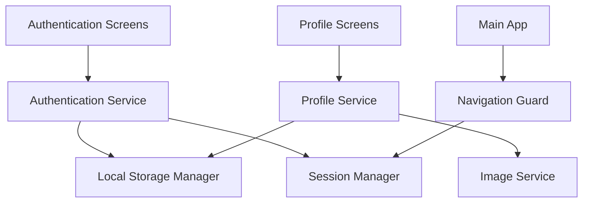

# Design Document

## Overview

This design document outlines the implementation approach for user authentication and profile management in PoultryCure. The solution will provide a complete authentication system with local data storage, secure credential management, and a user-friendly profile interface that integrates seamlessly with the existing React Native/Expo application.

## Architecture

### High-Level Architecture



### Data Flow

1. **Authentication Flow**: User credentials → Validation → Local Storage → Session Creation
2. **Profile Management Flow**: Profile Updates → Validation → Local Storage → UI Update
3. **Session Management Flow**: App Launch → Session Check → Route to Login/Main App

## Components and Interfaces

### Authentication System

#### AuthService
```typescript
interface AuthService {
  signup(userData: SignupData): Promise<AuthResult>
  login(credentials: LoginCredentials): Promise<AuthResult>
  logout(): Promise<void>
  resetPassword(email: string): Promise<void>
  changePassword(currentPassword: string, newPassword: string): Promise<void>
  getCurrentUser(): Promise<User | null>
  isAuthenticated(): Promise<boolean>
}
```

#### User Data Models
```typescript
interface User {
  id: string
  name: string
  email: string
  profilePhoto?: string
  createdAt: Date
  updatedAt: Date
}

interface SignupData {
  name: string
  email: string
  password: string
  confirmPassword: string
}

interface LoginCredentials {
  email: string
  password: string
}
```

### Profile Management System

#### ProfileService
```typescript
interface ProfileService {
  getProfile(): Promise<User>
  updateProfile(profileData: Partial<User>): Promise<User>
  uploadProfilePhoto(imageUri: string): Promise<string>
  deleteProfilePhoto(): Promise<void>
}
```

### Storage Layer

#### StorageManager
```typescript
interface StorageManager {
  storeUser(user: User): Promise<void>
  getUser(): Promise<User | null>
  storeCredentials(credentials: EncryptedCredentials): Promise<void>
  getCredentials(): Promise<EncryptedCredentials | null>
  clearUserData(): Promise<void>
  storeSession(sessionData: SessionData): Promise<void>
  getSession(): Promise<SessionData | null>
}
```

## Data Models

### User Profile Schema
```typescript
interface UserProfile {
  id: string
  name: string
  email: string
  profilePhoto?: string
  hashedPassword: string
  salt: string
  createdAt: Date
  updatedAt: Date
  lastLoginAt?: Date
}
```

### Session Schema
```typescript
interface SessionData {
  userId: string
  token: string
  expiresAt: Date
  createdAt: Date
}
```

## Screen Architecture

### Authentication Screens

1. **LoginScreen** (`app/auth/login.tsx`)
   - Email and password input fields
   - Login button with loading state
   - "Forgot Password" link
   - "Sign Up" navigation link

2. **SignupScreen** (`app/auth/signup.tsx`)
   - Name, email, password, confirm password fields
   - Signup button with validation
   - "Already have account" navigation link

3. **ForgotPasswordScreen** (`app/auth/forgot-password.tsx`)
   - Email input field
   - Reset instructions display
   - Back to login navigation

### Profile Screens

1. **ProfileScreen** (`app/(tabs)/profile.tsx`) - Enhanced
   - User avatar with edit capability
   - Profile information display
   - Menu items for account management
   - Logout functionality

2. **EditProfileScreen** (`app/profile/edit.tsx`)
   - Editable name field
   - Profile photo upload/crop
   - Save/cancel actions

3. **ChangePasswordScreen** (`app/profile/change-password.tsx`)
   - Current password verification
   - New password and confirmation fields
   - Security requirements display

## Security Considerations

### Password Security
- Minimum 8 characters with complexity requirements
- Client-side hashing using bcrypt or similar
- Salt generation for each password
- Secure storage using Expo SecureStore

### Data Protection
- Sensitive data encrypted at rest
- Session tokens with expiration
- Automatic logout on app backgrounding (optional)
- Input validation and sanitization

### Authentication Flow Security
- Rate limiting for login attempts
- Account lockout after failed attempts
- Secure password reset mechanism
- Session invalidation on logout

## Error Handling

### Authentication Errors
- Invalid credentials handling
- Network connectivity issues
- Validation error display
- Account lockout notifications

### Profile Management Errors
- Image upload failures
- Storage quota exceeded
- Invalid profile data
- Network timeout handling

### Recovery Mechanisms
- Offline data synchronization
- Graceful degradation
- Error retry logic
- User-friendly error messages

## Testing Strategy

### Unit Testing
- Authentication service methods
- Profile data validation
- Storage operations
- Password hashing/verification

### Integration Testing
- Authentication flow end-to-end
- Profile update workflows
- Image upload and processing
- Session management

### User Experience Testing
- Form validation feedback
- Loading states and transitions
- Error message clarity
- Navigation flow testing

## Implementation Phases

### Phase 1: Core Authentication
- Basic login/signup screens
- Local storage implementation
- Session management
- Password security

### Phase 2: Profile Management
- Profile viewing and editing
- Image upload functionality
- Password change feature
- Enhanced UI components

### Phase 3: Advanced Features
- Password reset mechanism
- Enhanced security features
- Performance optimizations
- Comprehensive error handling

## Technology Stack

### Core Dependencies
- **@react-native-async-storage/async-storage**: Local data persistence
- **expo-secure-store**: Secure credential storage
- **expo-image-picker**: Profile photo selection
- **expo-image-manipulator**: Image resizing and cropping
- **react-hook-form**: Form management and validation
- **bcryptjs**: Password hashing (if needed client-side)

### Navigation Integration
- Integrate with existing expo-router setup
- Authentication guards for protected routes
- Seamless navigation between auth and main app

### UI/UX Integration
- Consistent with existing theme system
- Reuse existing color scheme and spacing
- Maintain current design language
- Responsive design for different screen sizes